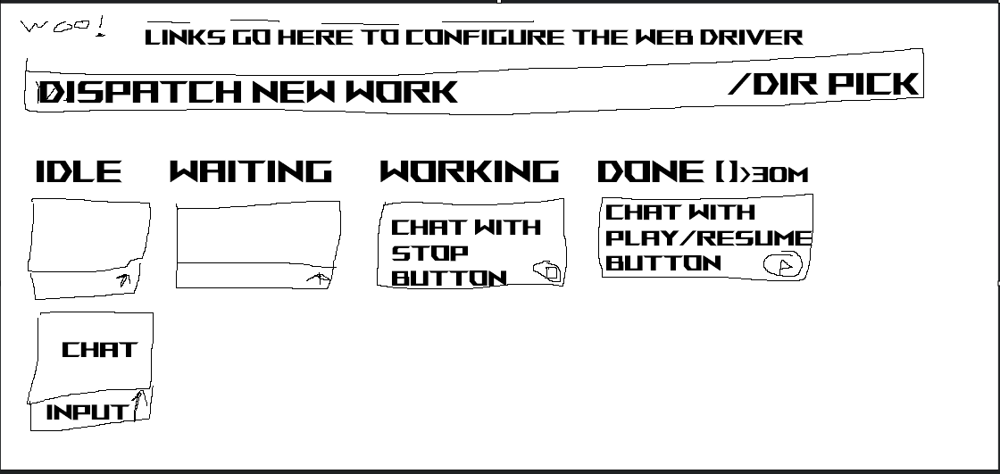

# seamux

**A root repo you open a Claude Code session in, which spawns and tracks all the other sessions, and serves a board over them.**

Status: all five phases are built and in daily use for feedback. This document is the brief.

Every capability claim below was probed against the running tools on 2026-09-23 rather than taken from documentation. Where something is marked `documented`, it comes from published docs and has not been run yet.



Jakob's sketch, 2026-09-23. It settles several things the research left open, and it is more ambitious than the earlier draft of this brief assumed.

## If you are picking this up cold

**All five phases are built**, in `~/code/seamux`, and the board is in daily use so Jakob can give feedback on it. Read **Running it** first, then **Findings while building**, which records every place the build corrected the research. The rest of this document is the design those phases implement.

Re-verify the foundation in under a minute if you want to trust it yourself:

```bash
claude agents --json --all                       # session state, the columns
claude --help | sed -n '/^Commands:/,$p'         # spawn, attach, logs, stop, rm, respawn
cmux capabilities                                # terminal.input.ordered.v1, events.v1, todo.v1
cmux rpc workspace.status.get '{}'               # inferred / override / effective + signals
cmux events --snapshot                           # the live stream's subscription shape
ls ~/.claude/projects/*/                         # per-session transcripts, JSONL
```

Four hard constraints, each of which exists for a reason stated below:

1. **Never destroy.** No `claude rm`, no `git worktree remove`, no timer that deletes. Cleanup is a prompt sent into the owning session, which is a whole section further down.
2. **Bind to localhost.** This spawns processes and injects text into live sessions. It stays on `127.0.0.1` until somebody decides otherwise on purpose.
3. **Do not rebuild the CLI surface.** Spawn, list, read, enter, drive, pause and reconcile all exist as commands today. The table below says which. Wrapping them is the job; reimplementing them is not.
4. **`claude agents --json` owns the columns.** cmux is blind to background sessions, measured and explained below, so its status cannot drive them. The transcript is the check on `busy`, for reasons in the findings.

## Running it

```bash
npm run setup    # install dependencies, the subagent hooks, and the dispatch skill
npm run serve    # run the board on http://127.0.0.1:5173 and keep it running
```

`setup` writes to two places outside the repo, both idempotent and both reversible:

- **`~/.claude/settings.json`** gains `SubagentStart` and `SubagentStop` hooks that run `hooks/subagent-event.ts`. It backs the file up first. `npm run hooks:uninstall` removes exactly its own entries.
- **`~/.claude/skills/seamux-dispatch/`** holds the protocol skill, rendered with this checkout's `bin/seamux` path. `npm run skills:uninstall` removes it, and never removes a skill it did not write.

Run `npm run serve` in its own cmux workspace. It serves the dev server from this checkout, so a change landed on `main` goes live by hot reload. It restarts the server if it exits, if it stops answering, or when `npm run land` asks after reinstalling dependencies. It also stops a server orphaned by an earlier supervisor that was killed, and refuses to run twice. The supervisor is plain Node with no macOS dependency, so it runs under Linux and WSL too, polling for file changes on WSL's `/mnt/` drives.

A landing can reload the board mid-sentence, so unsent text survives it: the dispatch prompt, its directory and worktree choice, and each card's reply draft are kept in the tab's `sessionStorage`, and so is which of those boxes had focus and where its cursor was: the reload puts the cursor back. An open chat stays open, scrolled to where it was, or to the end if you were reading the latest message; the page's own scroll position is restored by React Router. Sending clears the draft and the focus at once, so a reload while the send is in flight can't bring them back, and a failed send puts the draft back.

To change seamux, work in a worktree on your own branch, commit, and run `npm run land` there. `CLAUDE.md` has the details, for people and agents alike.

The store is SQLite at `data/seamux.db`, and fan-out files live in `data/dispatches/`. Both are gitignored, and deleting them loses only subagent history, card intents, pins, queued messages, settings and fan-out records, never a session.

This README is the brief and its own source of truth: edit it here. Prose in this repo is checked with Taskless.

## The problem, in Jakob's words

> My Taskless sessions are getting complex with worktrees and subagents. Messages arrive out of order, require massive context switches.

> If a channel spawns subagents we end up with muddled messages where everything is arriving out of order and the "parent" agent gets awfully confused.

> These are chats, but things progress from stage to stage and there's no good way to drive the work beyond a single chatbox.

> One mistake I've made in the past is asking a single agent to use worktrees/subagents to solve multiple problems when each one should be its own session.

## What already exists, so we do not rebuild it

| Need | Already provided by | Verified |
| --- | --- | --- |
| Session state and columns | `claude agents --json --all` gives `blocked` / `working` / `done` / `failed` plus `idle` / `busy` / `waiting`, across every project. A `waiting` row says why in `waitingFor` | yes |
| Spawn | `claude --bg`, prints a short id | yes |
| Read without entering | `claude logs <id>` | yes |
| Enter | `claude attach <id>` | yes |
| Pause, keeping history | `claude stop <id>` | yes |
| Drive from outside | `cmux rpc terminal.paste` then `surface.send_key enter`, into the session's surface. Paste arrives bracketed, so newlines stay inside one message; `cmux send` turns `\n` into Enter and would submit a multi-line message in pieces | yes |
| Find a session's surface | `cmux sessions list --json` maps `session_id` to `surface_id` and `workspace_id` | yes |
| Interrupt a turn | `surface.send_key escape`, the same as pressing Esc | yes |
| Lifecycle vocabulary | `workspace.status.*`: `todo` / `working` / `needs-attention` / `review` / `done` / `auto` | yes |
| Operator reconciliation | `workspace.status` carries `inferred`, `override`, `effective` | yes |
| Live event stream | `cmux events --after <seq> --cursor-file <path> --reconnect` | yes |
| New session in a workspace | `workspace.create` with `cwd` and `initial_command`. It silently ignores `command` | yes |
| Worktree creation | `claude --worktree <name>`, at spawn | yes |
| Splitting a tangent out | `claude --resume <id> --fork-session --session-id <new>`, which copies the whole context into a new session and leaves the parent alone. `cmux fork` was not needed | yes |

**The board is largely a UI over commands that ship today**, which is the useful finding here, and it means the build is small if we resist rewriting any of the above.

## The gaps that are actually ours

**Subagent visibility** is the first, and nothing in the field has it. `is_subagent` is `0` on all 14,393 rows of cmux's journal, and `claude agents` treats a session as one row. During the 272-firm sweep Jakob's vault ran 14 subagents inside one session, and every tool available would have shown a single calm card.

Closable two ways. **`SubagentStart`** and **`SubagentStop`** hooks carry `agent_id`, `agent_type` and `session_id`, with `last_assistant_message` on stop, and tool events fired inside a subagent carry `agent_id` too. Verified: this is what seamux uses. Separately, **`--forward-subagent-text`** emits subagent messages with `parent_tool_use_id` set when a session runs in `--print` with `--output-format stream-json`.

**The coordination protocol** is the second. The parent's confusion is a concurrency problem and the mitigations are mechanical, set out below.

**cmux's status cannot own the columns**, which is the third. Measured: the CLI monorepo workspace holds a background session that `claude agents` reports as `blocked`, while `cmux workspace.status.get` reports `effective: todo` with `any_agent_needs_input: false`. cmux derives status from surfaces it hosts, so a background session is invisible to it. It is blind rather than flaky.

**A web surface** is the fourth, since everything above is local CLI or a Mac app.

## Architecture

### The seamux repo

The simplest possible git repo, opened as a Claude Code session. It is the thing you talk to, and it holds:

- **Skills** for the actions: spawn a session, list the board, fork a tangent out, dispatch a fan-out set.
- **The web server** serving the board.
- **The state store** (SQLite).
- **Hook scripts** that sessions install, which report subagent lifecycle back to the store.
- **The protocol helpers** that workers use to write completion markers.

Being a Claude Code session itself is the point. You can talk to the dispatcher in the same way you talk to everything else, and the board is a second view onto what it knows rather than a separate application.

### State management

The rule is **never store what can be re-derived.** Two tiers:

**Derived, and never written to the store:** session state, liveness, workspace placement, git status. Poll `claude agents --json`, stream `cmux events`. If the store disagrees with the tools, the tools win.

**Durable, because nothing else holds it:**

| State | Why it cannot be derived |
| --- | --- |
| Card intent | The goal a session was spawned for. `claude agents` knows only that a session exists |
| Dispatch record | Which parent spawned it, from what prompt, at what checkpoint |
| Stage override | The human's correction when inference is wrong |
| Work log | The durable cross-session record, which survives a session being disposed |
| Subagent tree | Only exists in hook events, nowhere else |
| Pins | Jakob's word that a session is meant to run for a long time. Nothing about the session says so |
| Settings | Jakob's choices in the config dialog: picker directories, the worktree default, and the system macros |
| Dependencies | Which cards gate which |

### The board, from the sketch

Four columns: **IDLE**, **WAITING**, **WORKING**, **DONE**. Simpler than the union of what the tools report, and better, because each column answers a different question about Jakob's attention.

| Column | Means | Derived from |
| --- | --- | --- |
| IDLE | Alive, holding its worktree, nothing to do | `claude agents` `status: idle` with no block |
| WAITING | Blocked on a human | `claude agents` `status: waiting`, a turn that ended on a question, or a background child's `state: blocked` |
| WORKING | Running | `status: busy` when the transcript agrees a turn is in progress, or any of its subagents still running |
| DONE | Closed by Jakob | `claude stop`, or the chat closing |

DONE is hidden by default; a **Show done** toggle in the header, remembered per browser, brings it back.

The board follows the OS's light or dark theme until a sun or moon button beside the cog picks one, which is remembered per browser.

**PINNED sits left of the four**, for sessions that are meant to run for a long time by design. It appears only while something is pinned. A pin is Jakob's call, since nothing about a session says it is long-running, so it is one of the few things the store records. A pinned card stays in PINNED whatever its state, shown as a coloured dot beside its name, with the same controls it would have in its state's column. Closing a pinned chat keeps it in PINNED with its resume button for as long as its transcript exists, rather than letting it age off after 30 minutes. Unpinning puts it back in its state's column. Jakob, 2026-09-23: *"some sessions are meant to be long running by design."*

**WAITING means something is stopped until Jakob answers.** A blocked background session is; a failed one is over, so its parent stays where its own state puts it, with the failure shown as a red marker. This reverses an earlier call that failed meant waiting. Jakob, 2026-09-23: *"A failed background job is still idle then. It's not blocked waiting on me... right?"*

**A chat whose turn ended on a question is WAITING too**, although Claude Code reports it `idle`, since no dialog is open. The board reads it from the transcript: the last message ended the turn, and its text ends with a question mark. The card shows the question, the reply box answers it, and the chat can still be closed. Jakob, 2026-09-23: *"You asked a question, but you're back in 'idle'"*

**A message written to a working chat waits in seamux, not in Claude Code.** While a card is WORKING, or already has messages waiting, its reply box and the modal queue instead of sending, and the card reads `working +N`. The queue lives in the store, and the server sends its oldest message once the chat is IDLE, one per turn, whether or not a board tab is open. Until then the modal lists it, to edit, remove, or send now, which pastes it into the terminal for Claude Code to take at its next step. Claude Code's own queue, typed in the terminal, is listed above it, read-only, since it lives only in Claude Code's memory: editing it would mean driving the terminal's own recall key, which races the turn's end and whatever is half-typed in the prompt. A closed chat keeps its queue on its Done card until it is resumed. Jakob, 2026-09-23: *"maybe the \"next message\" queue is held locally in the seamux UI. That gets it out of the terminal and removes the pain point"*

**Background sessions are not cards.** A background session belongs to the chat that spawned it, and Jakob never drives one directly, so the board shows only that it exists, as a marker on its parent's card. Every piece of dispatched work is a new top-level session, which is what gets a card. `claude agents` records no parent, so a background session is attached to the live chats in its directory that started before it, since a chat cannot have spawned something older than itself. Jakob, 2026-09-23: *"backgound sessions have a parent. Those are just part of the main chat (mainly that they exist)... Every piece of dispatched \"Work\" is a new top level agent."*

**A background session that matches no open chat is listed below the board**, under "Background sessions not matched to an open chat". Its chat has closed, or runs in another directory. Clicking one opens a dialog showing its `claude rm <id>` command, with two buttons. Resume runs `claude attach <id>` in a new cmux workspace, which restarts it with its conversation. Delete dispatches a chat into the session's main checkout that checks it and runs `claude rm <id>` itself, stopping to ask before discarding unpushed work, because seamux never deletes. Jakob, 2026-09-23: *"I would make those that can be resumed, resumable with a play and an X that opens a modal with instructions to destroy the abandoned session."* Later that day: *"the modal with the command can have dangerous \"delete this session\" and \"resume this session\" button. This removes the tiny buttons from the pill"*

**DONE is entered by a human closing the chat**, which is the distinction that separates it from IDLE. A session that finishes its turn and has nothing left to do is **IDLE**: alive, holding its worktree, ready for more work. It becomes **DONE** when Jakob closes it. Jakob, 2026-09-23: *"when I close a chat, it's done."*

**Closing a chat runs the close-session macro, then closes its cmux tab.** The macro is a prompt, by default the cleanup prompt below; the board sends it, waits for that turn to end, and only then sends `/exit`. It leaves the chat open, with a note on the card, when the turn ends on a question, leaves uncommitted changes or the session's worktree behind, never starts, or runs past 30 minutes; closing it again exits without the macro. Stopping the turn calls the close off. With the macro empty, close exits straight away. The board then waits for Claude to leave the tab and closes that tab, or its workspace when it was the only tab. A workspace seamux launched would close itself, but a chat Jakob started by hand in his own tab would otherwise leave its shell open. The conversation stays on disk, so the chat can still be resumed. If Claude has not exited within ten seconds, the board leaves the tab open.

From there it decays on two timers, and both are display rules:

| Age | Shown | Session itself |
| --- | --- | --- |
| 0 to 30m | Card visible in DONE with a play / resume button | Stopped, conversation kept |
| 30m to 24h | Off the board, still reachable by search or direct link | Unchanged |
| Over 24h | Not rendered anywhere in the UI | Unchanged |

Jakob, 2026-09-23: *"disposal isn't needed fwiw. I think done > 24hr just means not visible at all in our ui."*

**So the dispatcher never deletes anything**, because both timers govern rendering and nothing governs the session's existence. A 25-hour-old session still exists, still has its worktree, and still appears in `claude agents --all`. The dispatcher has simply stopped drawing it. Cleaning up is Jakob's job with `claude rm`, on his own schedule, with his own judgement about uncommitted work.

That gives the system a property worth stating outright: **the dispatcher reads, spawns and drives, and never destroys.** No worktree is removed by a timer, no session is deleted, no history is discarded. Where a worktree genuinely should go, the dispatcher asks the session to do it, which is the next section. The worst a bug can do is show the wrong card or send input to the wrong session, and neither loses work. It also means the 24 hour number is cheap to get wrong, since changing it changes a query rather than a retention policy.

### Rendering and driving a card

Both halves are available today.

**Reading a conversation:** transcripts are JSONL at `~/.claude/projects/<project-slug>/<session-id>.jsonl`, one file per session. That is the card's content. `claude logs <id>` gives recent terminal output for a cheaper preview.

**What a waiting card is waiting on:** `claude agents` gives the kind, `waitingFor: "input needed"` for a question and `"permission prompt"` for an approval, and the transcript's last message is the tool call the dialog belongs to. An approval shows its command or path on the card, to approve in the terminal. An AskUserQuestion is answered on the card: the board drives the dialog with the same keys Jakob would press, so the model gets real answers, not an interrupted turn. Jakob, 2026-09-23: *"I don't want to reimplement the tools, but reimplementing things like AskUserQuestions might actually save us some headache."*

**Writing into a conversation:** a paste into the session's cmux surface, then Enter. `claude -p --resume <session-id>` looked like the path, but on a live session it starts a second process on the same conversation, so seamux never uses it on anything live. A closed chat is resumed in a new cmux workspace instead, so that it becomes live and drivable again.

### Cleanup is a prompt the session acts on

Deleting a worktree is real work that sometimes needs doing, and the dispatcher still should not do it. Jakob, 2026-09-23: *"deleting probably has a cleanup prompt. Something like 'remove your worktree and clean up after yourself. There may be other agents still working in this directory you're not aware of'."*

So cleanup is **a message sent into the session**, using the same reply path as every other write: a paste into the session's cmux surface. As built, it is the **close-session macro**, sent whenever Jakob closes an idle chat, and editable in the config dialog. The dispatcher gains no destructive capability, and the agent that owns the worktree is the one deciding what is safe to remove, with its own knowledge of which changes are already committed.

**The dispatcher's contribution is the part the agent cannot see**, since a session knows its own cwd and its own commits. It has no idea that two other sessions are live under the same repo. The dispatcher knows exactly that, from `claude agents --json`, so the prompt should carry the facts rather than a generic caution. The macro's `{{siblings}}` fills them in from the board's live cards:

```
Clean up after yourself and remove your worktree.

Before you do: there are 2 other sessions live under
/Users/jakob/code/taskless/cli right now (worktrees
claude-md-archive and fix/comparator-top-alignment).
Do not touch anything outside your own worktree, and do
not run a bare `git worktree prune` or anything that
operates on the whole repo.

If you have uncommitted work, say so and stop rather
than discarding it.
```

Three hazards that prompt is written against, all of which are real in this setup today:

- **Uncommitted work in the worktree**, which the agent can check while the dispatcher cannot.
- **Sibling worktrees on the same repo**, where a repo-wide command reaches outside the caller's own directory.
- **Another session sharing the same cwd**, which `claude agents --json` makes visible by grouping on `cwd`.

The result is worth keeping as a rule for the whole system: **when an action is destructive, the dispatcher asks the session to do it and supplies the cross-session context, rather than doing it itself.** The dispatcher's own verbs stay read, spawn and send.

Closing a chat maps to `claude stop <id>`, whose own help says "its conversation is kept: `claude attach <id>` opens it again". That is the resume path behind the play button, and it stays available indefinitely.

**Every card is a live chat with its own input**, which is the central decision and the answer to "no good way to drive the work beyond a single chatbox". A card is not a summary that links back to a terminal, it is the conversation, rendered, with a text box at the bottom. Fourteen cards means fourteen chat boxes on one screen.

Controls differ by column, and the sketch is specific:

- **WORKING** cards carry a **stop** button. It is disabled, with the reason on hover, when only the card's subagents are running (the chat's own turn has ended, so Esc has no turn to stop) or when the session is not in a cmux surface.
- **DONE** cards carry a **play / resume** button.
- Every card but a DONE one carries a **pin** button, which moves it into PINNED or back out. A closed chat can't be pinned; one pinned before it closed keeps its unpin button.
- An expanded card shows the transcript with an **input** field beneath it.
- Both inputs sit on a **context bar**, a gradient from green to red that fills as the chat's context window does, so a chat can be wrapped up or forked before Claude Code compacts it. It reads the last response's token usage from the transcript, and is empty until the first response after a compaction. Hovering it gives the numbers. Jakob, 2026-09-23: *"so the bar really feels like 'how full is this?' so we can avoid auto compaction as much as possible"*
- A card shows the end of its last reply **as markdown**, clipped to a few lines and faded in from the top when there is more, since the end is where a reply says what was done or asks what's next. The last prompt above it fades out at the bottom, so the two fade toward each other and the card reads as prompt, then reply. Jakob, 2026-09-23: *"The AI response should be the 'end' of the response, making it easy to see what's done or being asked."* The expanded chat renders every reply the same way. Links in either open in a new tab, so following one never navigates the board away.
- Every card's path carries a **coloured square** for its project, so cards from one repo can be picked out at a glance. A worktree under `.claude/worktrees/` or `worktrees/` belongs to its repo. The colour is one of 24, hashed from the project's path until one is picked by clicking the square. Picks are still kept in the browser's localStorage; they have not moved into the config yet.

**DISPATCH NEW WORK is the primary action**, a full-width bar above the columns with a **directory picker** beside it. Putting it there fixes the cost asymmetry, since the most prominent control on the screen starts a new session in a chosen directory, and spawning one becomes visibly cheaper than cramming another goal into an existing session.

**A cog beside the seamux name opens the config dialog**, the start of seamux's own settings, kept in the store. Its General tab holds the directories the picker offers, which replace the discovered list when any are set, and whether "new worktree" starts ticked. Its Macros tab holds the system macros, prompts the dispatcher sends as if Jakob typed them, with `{{name}}` variables filled in on sending:

- **New session** wraps the first prompt of every dispatched session, from the board or a fan-out. It must contain `{{prompt}}`, and defaults to just that. The card's goal shows what was typed, not the wrapped prompt.
- **Close session** is sent when Jakob closes an idle chat, as described above. It defaults to the cleanup prompt.

### Subagents come free when the dispatcher owns the session

`--forward-subagent-text` forwards subagent text and thinking blocks as messages **with `parent_tool_use_id` set**, in `--print` plus `--output-format stream-json` mode. So a session the dispatcher started in stream mode reports its own subagent tree, correlated to the parent tool call, with no hooks at all.

That resolves the own-versus-adopt question into two tiers rather than a choice:

- **Owned sessions** are spawned by the dispatcher in stream mode and give full subagent fidelity from the stream.
- **Adopted sessions** are started by hand in cmux and fall back to `SubagentStart` and `SubagentStop` hooks, which give the tree without the inline text.

Both work. Owning is better, and adopting is not a dead end, so the dispatcher can adopt from day one without painting itself into a corner.

**As built, there is one tier.** Sessions seamux starts are interactive sessions in cmux like any other, because Jakob drives them from the board and from the terminal alike, and stream mode would give up the terminal. So the hooks cover every session, owned or adopted. The stream tier remains available if inline subagent text becomes worth the trade.

### The coordination protocol

The part nobody else is building, and the reason the parent gets confused.

1. **A dispatch is a declared set**, so the parent writes a manifest with a dispatch id and the list of expected workers before spawning anything.
2. **Completion is a marker rather than file existence.** A worker writes its output, then atomically writes a `.done` marker carrying its correlation id and a result summary. During the 272-firm sweep the merge parsed `batch-07.md` before its worker had reported, purely because the file existed. It happened to be complete.
3. **The parent waits on a barrier.** It polls for the marker set rather than reacting to each handback as it lands. `PostToolBatch` fires after a full batch of parallel tool calls resolves and is worth evaluating as the native primitive.
4. **Handbacks are structured and keyed by correlation id.** All 14 prose reports each announcing their own batch number is a parsing problem the parent should not have.
5. **Merges are idempotent and honour a protected list.** That sweep survived its own early-parse bug only because re-running was safe and hand-authored entries were protected.
6. **Cursors are monotonic sequences.** cmux's `sequence` column, and `cmux events --cursor-file`.

**As built:** `bin/seamux fanout` writes the manifest, then spawns each worker as a top-level session with reporting instructions appended to its prompt. `bin/seamux done` writes `<worker>.done.json` by temp file and rename, and refuses a worker the manifest did not declare. `bin/seamux wait` is the barrier: run in the background, it exits once, when every worker has reported, and prints all handbacks keyed by worker. `PostToolBatch` was not needed, since a background command's exit already notifies the parent exactly once. Points 5 and 6 live in the skill's merge guidance rather than in code, because only the parent knows what its merge target is.

### Web surface

Reads from `claude agents --json`, `cmux sessions list`, cmux workspace status, the transcripts and the store, polled every 3 seconds while the tab is visible. Writes through cmux: paste and Enter to reply, Esc to stop, and `workspace.create` to resume, dispatch and fork. Every card names its cmux workspace, so the board never becomes the only way in.

Every write checks that the request's Host is local and its Origin matches it. A browser lets any website POST a form to `127.0.0.1`, so without that check any page Jakob visited could type into his sessions.

**Files a reply links to open in seamux.** A link in a reply to `./app/root.tsx`, `/Users/…/README.md` or `style.css:12` resolves against the session's directory and opens `/file?path=<absolute path>`: the seamux mark, the path, and a Raw or Rendered choice. Every file has Raw, highlighted by its extension. Markdown and HTML also render, markdown with its frontmatter as a YAML block at the top, HTML inside an iframe sandboxed to an opaque origin, so its scripts run but cannot act as the board. The viewer checks the file's modification time every second and reloads when it changes, so a file a session is still writing stays current. Fenced code in replies is highlighted too, when the fence names its language. File reads refuse requests from other sites. The sandboxed page's own requests are cross-site and carry no Referer, so they reach the file under a path holding a secret the server picks at startup.

**Auth is an open question the moment this leaves localhost**, because it can spawn processes and send input to live sessions, so the threat model is real. Phase 1 should bind to localhost and stay there.

## Phasing

All five are built, each as one commit on seamux's `phase-1-board` branch.

**Phase 1, read-only board**, being `claude agents --json` plus cmux enrichment served locally. Built as planned, plus a popout modal per card with the full conversation. Sending from the modal, with ⌘↵ or the Send button, closes it, back to the board.

**Phase 2, subagent visibility**, via `SubagentStart` and `SubagentStop` hooks writing to the store. Built. A card whose subagents are running sits in WORKING even when the parent is idle, which is the calm-card problem from the 272-firm sweep, fixed.

**Phase 3, drive from the board**: reply, stop, and resume. Never `claude rm`. The status override was left out, until the columns get something wrong in daily use.

**Phase 4, spawn**: the dispatch bar starts a new session with a directory, an optional worktree and a first prompt, and fork splits a tangent out of any chat. Each records its intent, which the card shows.

**Phase 5, the protocol**: manifests, completion markers and a barrier, as `bin/seamux` and the `seamux-dispatch` skill. The board shows each fan-out set and which workers have reported.

## Decisions

Settled by Jakob, 2026-09-23.

**Internal tool**, rather than a Taskless product. So there is no onboarding, no multi-user, no packaging, and no need to generalise past one setup: Claude Code plus cmux on macOS. Hard-code the conventions. The subagent layer and the coordination protocol are still the valuable parts, now because they fix a daily problem rather than because they are defensible.

**One Mac**, so there is no sync layer, no device identity and no push. Reading local files directly is fine, including `~/.claude/projects/<slug>/*.jsonl` and the cmux socket. Bind the server to localhost.

One consequence worth keeping in view: *one host* and *localhost-only* are different claims. The moment a phone on the same network opens the board, the binding changes and the auth question returns, because this thing can spawn processes and inject text into live sessions. Staying on `127.0.0.1` keeps that closed. Reaching it from a phone should be an explicit later decision with its own answer, rather than a config change made in a hurry.

**The remote surface is chats, arranged as a kanban board**, so the earlier framing of "board or chat" was a false choice. A card *is* a conversation, and the columns are a layout over those conversations rather than a separate summary view. This is what the sketch already showed, and it is the whole answer to driving work beyond a single chatbox: the board is N chat windows, grouped by what each one needs from Jakob.

## Findings while building

Each of these corrected something the research had marked verified or documented. They are listed because the next reader would otherwise trust the older claim.

- **`status: busy` does not mean a turn is running.** Claude Code also sets it while internal helper agents run between turns, and while a background shell runs after the turn has ended. The board treats a session as working only when the transcript's last message agrees: a turn is over once the last message is an assistant message with `stop_reason: end_turn`, an interruption, or a harness-written turn such as `/compact`.
- **Helper agents fire `SubagentStop` with an empty `agent_type` and never fire `SubagentStart`.** The hook ignores them. Counting them showed three subagents where there was one.
- **Claude Code records subagents on disk.** Each session's transcript directory holds `subagents/agent-<id>.jsonl` and `agent-<id>.meta.json`, with the description, type, parent tool call and spawn depth. The research's "nothing has it" held for cmux and `claude agents`, but not for the transcripts. The board reads descriptions from there rather than storing them.
- **`workspace.create` ignores `command`.** The field is `initial_command`, run through `zsh -lc`.
- **That login shell does not read `~/.zshrc`**, so neither `claude` nor `node` is on its `PATH`. seamux launches through cmux's own `cmux-claude-wrapper`, which also registers the session with cmux, with `~/.local/bin` and the server's Node directory prepended. Launching `claude` directly starts a session cmux never learns about, which the board then cannot drive.
- **cmux RPCs default to the caller's own surface.** A call without a `surface_id` acts on whatever terminal seamux itself runs in. seamux always resolves the surface server-side and passes it explicitly.
- **A workspace closes itself when its `initial_command` exits**, but a chat started by hand leaves its shell prompt behind after `/exit`. **`surface.close` refuses a workspace's last tab** (`Cannot close the last surface`), so for the last tab seamux calls `workspace.close` instead.
- **A resumed chat is invisible for a few seconds.** Until the new workspace starts Claude, nothing reports the session as live, so a second resume in that window started a second process on the same conversation. The server now claims a session before its first check and holds the claim for 60 seconds.
- **Idle and waiting are separate `status` values.** `claude agents` reports `status: waiting` while a dialog is open, with `waitingFor` set to `input needed` for AskUserQuestion or `permission prompt` for an approval. The research listed only `idle` and `busy`, so the board used to depend on cmux for WAITING and missed sessions outside it.
- **cmux's `any_agent_needs_input` goes stale.** It stayed `true` on a session that `claude agents` reported `busy` and whose screen showed a running command, with no dialog open. The board no longer reads it.
- **AskUserQuestion answers by digit.** On a single-select question a digit picks and moves on, and it submits outright when it is the only question. On a multi-select question, digits toggle and Tab moves on. The digit after the last option is "Type something", and a paste there submits the text. With several questions, or any multi-select one, a review screen comes last and `1` submits it. Measured against Claude Code 2.1.281.
- **A new folder stops on a trust dialog that nothing reports.** Before Claude Code starts, it asks whether the folder is trusted: no `claude agents` row, no transcript, cmux sees no input needed. Its default is "No, exit". Choosing a folder to dispatch into is that decision, so every launch watches the new surface for the dialog and answers yes.
- **A background session without a process is still listed.** `claude agents --json --all` keeps a stopped or dead background session with its last `state`, `blocked` for one that stopped on a question, but with no `pid` or `status`, and `claude logs` reports it not found. `claude attach <id>` restarts it with its conversation, even when its transcript file is missing, since it restores from the job in `~/.claude/jobs/<id>`. Once running it has a `pid` and `status` again.
- **cmux's wrapper passes `claude` subcommands straight through.** `attach`, `agents` and the rest get no session id or hook settings, so a session opened with `claude attach` has no cmux surface the board can find, and its card cannot be typed into from the board.
- **The transcript logs the input queue, but a dequeue is not first in, first out.** Each change is a `queue-operation` line: `enqueue` with the item's text, `dequeue`, `remove` with the text it drops, and `popAll`. A `dequeue` takes a typed prompt ahead of queued `<task-notification>` and `<agent-message>` hand-backs, which is how replaying the log leaves no typed prompt queued in any closed transcript. The board replays it to count and list what is queued in the terminal.
- **Transcripts do not record the context window.** Each response logs its token usage, but a 1M-token Opus session is logged as plain `claude-opus-5`, the same as a 200k one; only `/context` output names `[1m]`. Opus sessions here have run to 999k, so the context bar assumes 1M for Opus and 200k for anything else, raising it to 1M once a response holds more than 200k.
- **The global hook is required.** A hook fires in the session that starts the subagent, so a hook in seamux's own project settings would only ever see seamux's own subagents.

## What is left open

Nothing blocking. These wait on feedback from daily use:

1. **The status override**, Jakob's correction when a column is wrong. Worth building only once the columns are wrong often enough to matter.
2. **The 30m to 24h tier**: closed chats past 30 minutes are off the board with no search yet.
3. **The work log**, which still has nothing writing to it.
4. **Polling versus `cmux events`**: the board polls every 3 seconds, at about half a second per poll. The event stream would cut both, if polling ever feels slow.
5. **Leaving localhost**, which remains a deliberate later decision with its own auth answer.
